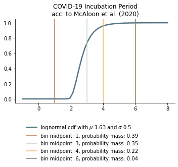
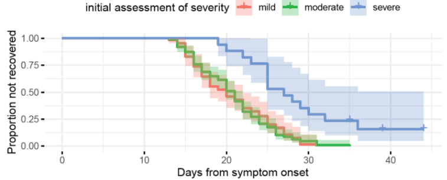

.. _epi-params:

Epidemiological Parameters
==========================

This section presents the epidemiological parameters for COVID-19. Their values are
stored in `covid_epi_params.csv
<https://github.com/COVID-19-impact-lab/sid/blob/main/src/sid/covid_epi_params.csv>`_.

Health System
-------------

This category only contains the icu_limit_relative. This entry gives the number of ICU
beds per individual.

Sources:
    - `Deutsche Krankenhausgesellschaft
      <https://www.dkgev.de/dkg/coronavirus-fakten-und-infos/>`_
    - `Intensivregister <https://www.intensivregister.de/#/intensivregister>`_

Immunity Countdown
------------------

Due to the novelty of COVID-19, no reliable information on the duration of immunity
exists yet. However, according to `the German RKI <https://www.rki.de/DE/Content/InfAZ/
N/Neuartiges_Coronavirus/Steckbrief.html#doc13776792bodyText14>`_ people have been
reported to develop specific anti bodies within two weeks of infection and evidence from
the related SARS and MERS viruses suggest immunity of up to 3 years.
Note, however, that there have also been
`case reports of reinfection <https://doi.org/10.1136/bmj.m3340>`_
SID supports both heterogeneous, stochastic and no lasting immunity so we can check
how different immunity patterns affect our results.
As baseline we set the length of immunity to 1000 days (2.7 years) for all individuals.

Countdown from Infection to the Begin of Infectiousness
-------------------------------------------------------

The period between infection and onset of infectiousness is called latent or latency
period. The corresponding countdown is called `cd_infectious_true`.

However, the latency period is rarely given in epidemiological reports on COVID-19.
Instead, scientists and agencies usually report the incubation period, the period from
infection to the onset of symptoms. A few studies used measurements of virus shedding to
estimate infectiousness during the course of the disease. When measurements started
before the onset of symptoms the development of the viral load before symptoms gives us
an indication of number of days between the onset of infectiousness and symptoms.

The `ECDC (2020-06-24, question 5)
<https://www.ecdc.europa.eu/en/COVID-19/questions-answers>`_ gives a period of 1-2 days
between the onset of infectiousness and the onset of symptoms. This is in line with a
`study published in Nature <https://doi.org/10.1038/s41591-020-0869-5>`_ who estimate
the onset of infectiousness at 2.3 days (CI: 0.8–3.0 days) before symptoms. This also
aligns with a `study published in the Lancet
<https://www.thelancet.com/journals/laninf/article/PIIS1473-3099(20)30361-3/fulltext>`_.

Estimates of the incubation period usually give a range from 2 to 12 days.

A `meta-analysis by McAloon et al. (2020-07-23)
<https://bmjopen.bmj.com/content/bmjopen/10/8/e039652.full.pdf>`_ comes to the
conclusion that "The incubation period distribution may be modelled with a lognormal
distribution with pooled mu and sigma parameters (95% CIs) of 1.63 (95% CI 1.51 to 1.75)
and 0.50 (95% CI 0.46 to 0.55), respectively."

We discretize the incubation period as follows:

To arrive at the latency period we abstract 1 from each of these, except for the one
that is one. This is because countdowns are reduced by one before they cause changes,
i.e. if a countdown "starts" at zero it will not have an effect while a countdown of
one will take effect at the end of the current period (i.e. after individuals meet).

We do not separate between age groups as
`He et al. (2020-04-15) <https://doi.org/10.1038/s41591-020-0869-5>`_
do not report differences in viral loads across age groups and disease severity.

.. We follow the
.. distribution reported by `Lauer et al. (2020)
.. <https://www.acpjournals.org/doi/full/10.7326/M20-0504>`_. They report the following
.. percentiles for the incubation period:
..
.. .. csv-table::
..     :header: "percentile", "incubation period"
..
..         2.5%, 2.2
..         25.0%, 4
..         50.0%, 5.2
..         75.0%, 6.8
..         97.5%, 11.5
..
.. We interpolate these percentiles to create an empiric cdf of the incubation period:
..
.. .. image:: ../_static/images/cd_infectious_true_cdf.png
..
.. With the resulting distribution:
..
.. .. image:: ../_static/images/cd_infectious_true_full.png
..
.. For our estimates of the latency period we assume a latency period equal to the
.. incubation period minus 2 days.
..
.. These numbers also agree with estimates by
.. `Linton et al. (2020) <https://www.mdpi.com/2077-0383/9/2/538/htm>`_ and
.. `He et al. (2020-05-29) <https://onlinelibrary.wiley.com/doi/full/10.1002/jmv.26041>`_.

However, calculating back from the symptomatic cases leaves the case of asymptomatic
cases unclear. To our knowledge no estimates for the latency period of asymptomatic
cases of COVID-19 exist. We assume it to be the same for symptomatic and asymptomatic
cases.

Thus, we arrive at the following lengths for the latency period:

.. csv-table::
    :header: "days until infectiousness starts", "probability"

        1, 0.39
        2, 0.35
        3, 0.22
        5, 0.04

Duration of Infectiousness
---------------------------

The countdown is called `cd_infectious_false`.

We assume that the duration of infectiousness is the same for both symptomatic and
asymptomatic individuals as `evidence suggests little differences
<https://pubmed.ncbi.nlm.nih.gov/32442131/>`_ in the transmission rates of corona virus
between symptomatic and asymptomatic patients and that `the viral load
<https://www.nejm.org/doi/10.1056/NEJMc2001737>`_ between symptomatic and asymptomatic
individuals are similar (see also
`Singanayagam et al. (2020-08-13)
<https://doi.org/10.2807/1560-7917.ES.2020.25.32.2001483>`_ and
`Byrne et al. (2020-07-10)
<https://bmjopen.bmj.com/content/bmjopen/10/8/e039856.full.pdf>`_).

Our distribution of the duration of infectiousness is based on
`this meta analysis by Byrne et al. (2020-07-10)
<https://bmjopen.bmj.com/content/bmjopen/10/8/e039856.full.pdf>`_.

For symptomatic cases they arrive at 0-5 days before symptom onset (figure 2) and
3-8 days of infectiousness afterwards.
(Viral loads may be detected much later but 8 days seems
to be the time after which most people are culture negative, as also reported `here
<https://www.eurosurveillance.org/content/10.2807/1560-7917.ES.2020.25.32.2001483>`_.)
Thus, we arrive at 0 to 13 days as the range for infectiousness among individuals who
become symptomatic (see also figure 5).
This duration range is very much in line with the meta-analysis' reported evidence
for asymptomatic individuals (see their figure 1).

Following this evidence we assume the following discretized distribution of the
infectiousness period.

.. csv-table::
    :header: "duration of infectiousness", "probability"

        3, 0.1
        5, 0.25
        7, 0.25
        9, 0.2
        11,0.2

.. ###We follow the `OpenABM-Project (2020-09-14)
.. ###<https://github.com/BDI-pathogens/OpenABM-Covid19/blob/master/documentation/
       parameters/parameter_dictionary.md>`_
.. ###and their sources (Ferretti et al in prep 2020; Ferretti & Wymant et al 2020;
.. ###Xia et al 2020; He et al 2020; Cheng et al 2020) who give a mean
.. ###infectious period of 5.5 days with a standard deviation of 2.14 days.
.. ###Assuming a normal distribution we can discretize the distribution as follows:
.. ###
.. ###.. image:: ../_static/images/infectiousness_period.png
.. ###
.. ###.. csv-table::
.. ###    :header: "duration of infectiousness", "probability"
.. ###
.. ###        2, 0.12
.. ###        4, 0.29
.. ###        6, 0.47
.. ###        10, 0.12
.. ###
.. ###.. https://www.sciencedirect.com/science/article/pii/S0163445320304497:
.. ###.. - "highest viral loads from upper respiratory tract samples were observed
            at the time of symptom onset and for a few days after
            (generally within one week),
.. ###     with levels slowly decreasing over the next one to three weeks"
.. ###.. - "Seven studies measured viral load in pre-symptomatic or asymptomatic
.. ###      patients, and generally found little to no difference in viral load between
            pre-symptomatic, asymptomatic and symptomatic  patients"
.. ###.. - "median duration of virus detection from symptom onset using upper
            respiratory tract samples was 14.5 days"
.. ###.. - "No study was found that definitively measured the duration of infectivity."
.. ###
.. ###.. warning::
.. ###
.. ###    These values are at odds with two other studies: `this study
.. ###    <https://doi.org/10.2807/1560-7917.ES.2020.25.32.2001483>`_ found that
.. ###    40% of individuals were culture-positive 7 days after symptom onset.
.. ###    Given that the median incubation period is 5 days, this data would predict that
.. ###    40% of individuals are still infectious 12 days after infectiousness starts.
.. ###
.. ###    Also, `this meta-analysis <https://bmjopen.bmj.com/content/10/8/e039856>`_ reports
.. ###    an estimated mean time from symptom onset to end of infectiousness of 13.4 days
.. ###    (95%CI: 10.9-15.8) with shorter estimates for children and less severe cases.

Length of the Presymptomatic Stage
----------------------------------

The presymptomatic stage is the time between the onset of infectiousness and the
onset of symptoms. The corresponding countdown is called `cd_symptoms_true`.

As we used the incubation time (the time from infection to symptoms) to calculate the
latency period, the length of `cd_symptoms_true` follows mechanically from the estimated
number of days by which infectiousness precedes symptoms. In the case of COVID-19 we
assume that the countdown is either 1 or 2 for symptomatic courses of the disease.
This is in agreement with the composite inferred model on the infectiousness period by
the `meta-analysis for the infectiousness period (figure 5)
<https://bmjopen.bmj.com/content/bmjopen/10/8/e039856.full.pdf>`_.

However, a significant share of infected and infectious individuals never develop
symptoms.

A big problem with estimating the share of asymptomatic individuals is that they can be
difficult to find. In addition, in the beginning, tests have been a precious resource
in the fight against COVID-19 - usually reserved for those with symptoms and their
contacts.
Korea has had a stellar performance in testing a large fraction of its population.
We therefore rely on the `Korean CDC reported 33% of asymptomatic cases
<https://www.ijidonline.com/article/S1201-9712(20)30344-1/abstract>`_.

Other sources with more or less similar estimates of asymptomatic cases include:
    - 13% of Chinese children (<15 years) (`Dong et al. (2020)
      <https://pediatrics.aappublications.org/content/145/6/e20200702>`_)
    - 15-20% on the Diamond Princess (`Mizumoto et al. (2020)
      <https://www.eurosurveillance.org/content/10.2807/
      1560-7917.ES.2020.25.10.2000180/#html_fulltext>`_)
    - 30.8% (CI: 7.7–53.8%) from Japanese evacuees (`Nishiura and Kobayashi
      <https://www.ncbi.nlm.nih.gov/pmc/articles/PMC7270890/>`_)
    - 46% (CI: 18-74%) from a meta study by (`He et al. (2020-05-29)
      <https://onlinelibrary.wiley.com/doi/full/10.1002/jmv.26041>`_)

We split the remaining probability mass evenly between 1 and 2 days for the
presymptomatic stage:

.. csv-table::
    :header: "duration of pre-symptomatic stage", "probability"

        1,0.335
        2,0.335
        no symptoms,0.33

.. note:: The `OpenABM project <https://tinyurl.com/y5owhyts>`_ has
    asymptomatic probabilities by age group,
    ranging from 0.19 for those >80 to 0.45 for those <9.

Duration of Symptoms
---------------------

We use the duration reported by `Bi et al. (2020-03-19, Figure
S3, panel 2)
<https://www.medrxiv.org/content/10.1101/2020.03.03.20028423v3.article-info>`_ to
recovery of mild and moderate cases that we assume to not require intensive care as
estimates for the duration of symptoms and infectiousness for asymptomatic and non-ICU
cases.

We collapse the data to the following distribution:

.. csv-table::
    :header: "days until recovery", "probability"

    15, 10%
    18, 30%
    22, 30%
    27, 30%

These long symptom durations align with
`reports by the CDC <https://dx.doi.org/10.15585%2Fmmwr.mm6930e1>`_.

These numbers are only used for mild cases.
We do not disaggregate by age. Note that the the length of symptoms is not very
important in our model given that individuals stop being infectious
before their symptoms cease.

Time from Symptom Onset to Admission to ICU
-------------------------------------------

The data on how many percent of symptomatic patients will require ICU is pretty thin. We
rely on data by `the US CDC
<https://www.cdc.gov/mmwr/volumes/69/wr/mm6924e2.htm?s_cid=mm6924e2_w#T3_down>`_ and
the `OpenABM-Project (2020-09-14) <https://tinyurl.com/y5owhyts>`_.

In the OpenABM project, the fraction of asymptomatic individuals ($P(Not Symptomatic)$),
the fraction of individuals needing to be hospitalized ($P(H)$) and
the fraction of hospitalized cases requiring ICU ($P(ICU|H)$) are given.

Thus, the percentages of symptomatic individuals
who will require intensive care is

.. math::
    P(ICU | Symptomatic) \newline

    &= \frac{P(ICU)}{P(Symptomatic)} \newline

    &= \frac{P(ICU | H) \cdot P(H | Symptomatic) \cdot P(Symptomatic)}{
    P(Symptomatic)} \newline

    &= P(ICU | H) \cdot P(H | Symptomatic) \cdot P(Symptomatic)

To calculate this we need to go from the fraction of infected individuals needing
hospitalization to the fraction of symptomatic individuals needing hospitalization.
Assuming that only symptomatic individuals need hospitalization we can use the
definition of the conditional probability:

.. math::
    P(H | Infected) &= P(H | Symptomatic) \cdot P(Symptomatic) \newline

    \Leftrightarrow P(H | Symptomatic) &= \frac{P(H | Infected)}{P(Symptomatic)}

Thus,

.. math::
    P(ICU | Symptomatic) &= P(ICU | H) \cdot \frac{P(H | Infected)}{P(Symptomatic)}
    \cdot P(Symptomatic) \newline

    &= P(ICU | H) \cdot P(H | Infected)

Calculating this for each age group we arrive at the following probabilities of
requiring intensive care.

.. csv-table::
    :header: "age group", "probability CDC", "probability OpenABM"

        0-9,0.007,0.00005
        10-19,0.004,0.00030
        20-29,0.005,0.00075
        30-39,0.009,0.00345
        40-49,0.0015,0.01380
        50-59,0.025,0.03404
        60-69,0.067,0.10138
        70-79,0.166,0.16891
        80-100,0.287,0.26871

.. warning::
    The CDC's reported age gradient is very small. Only 3.6% of individuals over 80
    years old require intensive care. While the death rate is 28.7%. This seems to stem
    from the ICU share assuming no ICU for those where ICU information is missing. We
    therefore use the maximum of the death and ICU rate.

The two sources align very well. We take the OpenABM data rounded to whole percent.

.. Other sources often only report the proportion of hospitalized cases admitted to ICU.
.. According to the collection of the `MIDAS network <https://midasnetwork.us/COVID-19/>`_
.. the proportion of hospitalized cases to ICU reported were: 0.06, 0.11, 0.26, 0.167
.. According to the information provided by the `RKI <https://www.rki.de/DE/Content/InfAZ
.. /N/Neuartiges_Coronavirus/Steckbrief.html#doc13776792bodyText19>`_ the proportion of
.. hospitalized cases in Germany was around 20%. `In Shanghai the rate is reported to be
.. 8.8%. <https://doi.org/10.1016/j.jinf.2020.03.004>`_

For those who will require intensive care we follow
`Chen et al. (2020-03-02) <https://doi.org/10.1016/j.jinf.2020.03.004>`_
who estimate the time from symptom onset to ICU admission as 8.5 +/- 4 days.

.. OpenABM:
.. mean_time_to_hospital,all,5.14
.. mean_time_to_critical,all,2.27
.. sd_time_to_critical,all,2.27
.. THEY DO NOT REPORT THE SD ON TIME TO HOSPITAL.

This aligns well with numbers reported for the time from first symptoms to
hospitalization: `The Imperial College reports a mean of 5.76 with a standard deviation
of 4. <https://spiral.imperial.ac.uk/bitstream/10044/1/77344/
12/2020-03-11-COVID19-Report-8.pdf>`_ This is also in line with the `durations collected
by the RKI <https://www.rki.de/DE/Content/InfAZ/N/Neuartiges_Coronavirus/
Steckbrief.html#doc13776792bodyText16>`_.

We assume that the time between symptom onset
and ICU takes 4, 6, 8 or 10 days with equal probabilities.

These times mostly matter for the ICU capacities.

Death and Recovery from ICU
---------------------------

We take the survival probabilities
from `the OpenABM Project <https://tinyurl.com/y5owhyts>`_.

.. warning:: Missing: `cd_needs_icu_false` for those that survive and time until death
    for those that don't!

.. #`The RKI <https://www.rki.de/DE/Content/InfAZ/N/Neuartiges_Coronavirus/
.. #Steckbrief.html#doc13776792bodyText23>`_ cites that a share of 40% of patients
.. #admitted to the ICU died. In Italy `Grasselli et al. (2020-04-06)
.. #<https://jamanetwork.com/journals/jama/fullarticle/2764365>`_ report that 26% of ICU
.. #patients died. We take the midpoint of 33%.
.. #
.. #.. warning::
.. #
.. #    There exist studies where the share of people who died is much larger than the
.. #    admitted of patients admitted to ICU. For example `Richardson et al.
.. #    <https://jamanetwork.com/journals/jama/article-abstract/2765184>`_ report 14% ICU
.. #    and 21% death rate. In sid only individuals admitted to intensive care can die.
.. #
.. #We assume that patients in ICU that die do so after 3 weeks. This follows the `3 to 6
.. #weeks of hospital duration reported by the RKI <https://www.rki.de/DE/Content/InfAZ/N/
.. #Neuartiges_Coronavirus/Steckbrief.html#doc13776792bodyText18>`_.
.. #
.. #This also aligns with `Chen et al. (2020-04-02)
.. #<https://doi.org/10.1016/j.jinf.2020.03.004>`_ where over 50% of ICU patients still had
.. #fever after 20 days at the hospital.
.. #
.. #We use a smaller time until ICU exit for those surviving, assuming they "only"
.. #require 2 weeks of ICU care.
.. #
.. #As with admission we do not distinguish between hospital and ICU exit.
